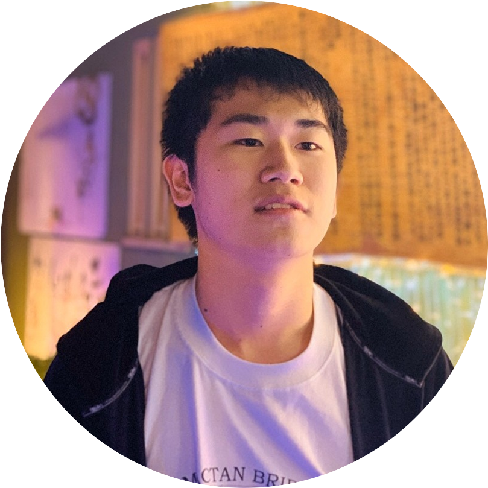

# About
私の名前は平松賢人です。

HP制作やちょっとしたアプリなら作れます。将来的にはSNSや掲示板サイトなどを作っていきたいです。

## Profile  
[リンク](https://twitter.com/dakarananii_756)
- (名前)ダカラナニー 
- (出身)ダカラナニー株式会社
- (特技)料理
- (タイムライン)
<a class="twitter-timeline" data-width="400" data-height="600" href="https://twitter.com/dakarananii_756?ref_src=twsrc%5Etfw">Tweets by dakarananii_756</a> 

# Skills
HTML,CSS,JavaScript,Node.js,Vue.js

# Works
自己紹介サイト
電卓アプリ
ジャンケンアプリ
カレンダー
(サイトのURLは過去のMacBookと共に紛失)

# Histrory

学歴
- 2007 大東中央幼稚園入園
- 2010 大東中央幼稚園卒園,住道南小学校入学
- 2016 住道南小学校卒業、大阪桐蔭中学入学
- 2019 大阪桐蔭中学卒業、N高等学校(心斎橋キャンパス通学コース)入学

経験
- 2019 chatboxインターン
- 2019 子ども食堂認定ボランティア
- 2020 不登校イベント主催ボランティア
- 2020 心斎橋キャンパスプログラミングサークル設立

# Favorite
<iframe width="560" height="315" src="https://www.youtube.com/embed/zi59WL9LxZY" frameborder="0" allow="accelerometer; autoplay; encrypted-media; gyroscope; picture-in-picture" allowfullscreen></iframe>
